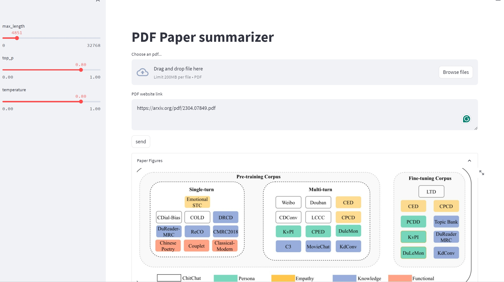
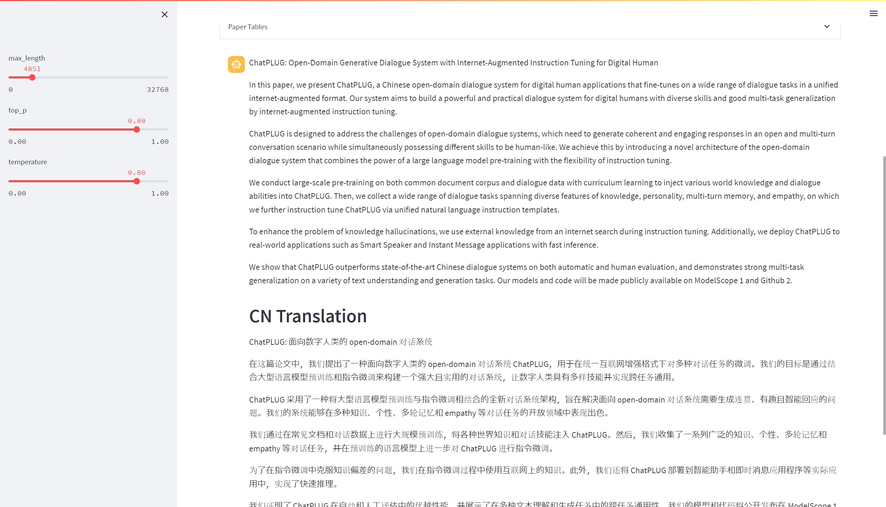

# PDF Summarizer

This project presents a purely simple local attempt for summarizing academic PDF with learning-based tool-box.

## Main Components and Functions

#### Components and Setup

This project contains the following parts:

1. PyMuPDF PDF parser to handel PDF files.
2. EfficientDet Layout detection model from [layoutparser](https://github.com/Layout-Parser/layout-parser?tab=readme-ov-file). Install with `pip install "layoutparser[effdet]"`.
3. Open-source EN/CN LLM [ChatGLM](https://github.com/THUDM/ChatGLM-6B). Install pytorch with cuda and transformers (version<4.37.0).
4. Streamlit library for web page creation.

After installing libraries for layoutparser and ChatGLM, run `pip3 install -r requirements.txt` to install other dependencies.

Start the local serving with 

`python3 -m streamlit run web_ui.py --server.fileWatcherType none`

#### Functions

1. Accept PDF upload / link upload.
2. Extract all figures and tables in the PDF file.
3. ChatGLM tries to summarize the paper's idea from the first a few thousands of characters of the text (depends on parameters and GPU memory). Giving response in English first, then in Chinese.

## Examples

Take the chatGLM paper as example.

